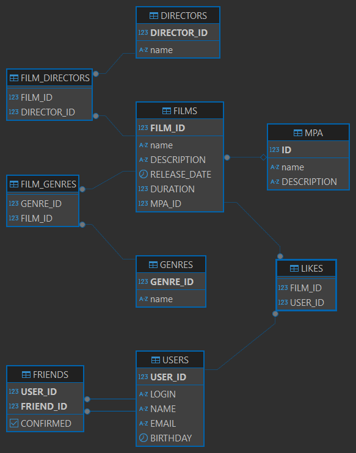

# java-filmorate


## DB sheme


### Query

Создание бд, [скрипты](./src/main/resources/db/changelog)


GET /films/{id}
```
SELECT f.*, m."name" AS mpa_name
FROM filmorate.films f
JOIN filmorate.MPA m ON f.MPA_ID = m.id
WHERE f.film_id = ?
```

GET /films
```
SELECT f.*, m."name" AS mpa_name
FROM filmorate.films f
JOIN filmorate.MPA m ON f.MPA_ID = m.id
```

POST /films
```
INSERT INTO filmorate.film ("name", description, release_date, duration, mpa_id)
VALUES(?, ?, ?, ?, ?)
INSERT INTO filmorate.film_genres (genre_id, film_id)
VALUES(?, ?)
```
PUT /films
```
UPDATE filmorate.films
SET "name" = ?,
description = ?,
release_date = ?,
duration = ?,
mpa_id = ?
WHERE film_id = ?
```

PUT /films/{id}/like/{userId}
```
INSERT INTO filmorate.likes (film_id, user_id)
VALUES(?, ?)
```

DELETE /films/{id}/like/{userId}
```
DELETE FROM filmorate.likes WHERE film_id = ? and user_id = ?
```

GET /films/popular
```
SELECT l.FILM_ID FROM FILMORATE.likes l
GROUP BY l.FILM_ID
ORDER BY COUNT(l.FILM_ID) DESC
LIMIT ?
```

GET /users/{id}
```
SELECT * FROM filmorate.users WHERE user_id = ?
```

GET /users
```
SELECT * FROM filmorate.users
```

POST /users
```
INSERT INTO filmorate.users(login, name, email, birthday)
VALUES (?, ?, ?, ?)
```

PUT /users
```
UPDATE filmorate.users
SET login = ?, name = ?, email = ?, birthday = ? WHERE user_id = ?
```

GET /users/{id}/friends
```
SELECT u.*, f.CONFIRMED FROM FILMORATE.users u
JOIN FILMORATE.FRIENDS f ON u.USER_ID = f.FRIEND_ID
WHERE f.USER_ID = ?
```

PUT /users/{id}/friends/{friendId}
```
INSERT INTO filmorate.friends (confirmed, user_id, friend_id)
VALUES(?, ?, ?)
```

DELETE /users/{id}/friends/{friendId}
```
DELETE FROM FILMORATE.FRIENDS WHERE USER_ID = ? AND FRIEND_ID = ?
```

GET /genres
```
SELECT * FROM filmorate.genres ORDER BY genre_id
```

GET /genres/{id}
```
SELECT * FROM filmorate.genres WHERE genre_id = ?
```

GET /mpa
```
SELECT * FROM filmorate.mpa ORDER BY id
```

GET /mpa/{id}
```
SELECT * FROM filmorate.mpa WHERE id = ?
```